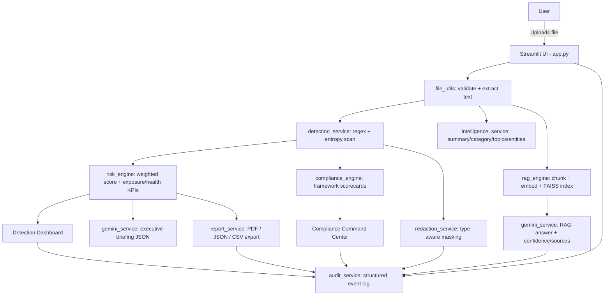

# 🛡️ Proteccio Data — AI Compliance Intelligence Platform (v2.0)

An enterprise-grade AI compliance and data-security platform built with
Streamlit and Google Gemini. Upload a document, get instant document
intelligence, detect sensitive data, understand risk exposure across
executive KPIs, map findings to compliance frameworks, redact sensitive
values with before/after comparison, and chat with your document via
retrieval-augmented generation — all in a dark, glassmorphic dashboard
built to feel like a real security operations product (Purview / Wiz /
Falcon-class), not a script demo.

**v2.0 changes:** removed the API-key input entirely (Gemini now loads
silently from `.env`), replaced the flat Streamlit look with a custom
dark/glassmorphic design system, replaced the raw-text preview with a
tabbed Document Intelligence Overview, expanded the Detection Dashboard
into a 6-KPI executive view with severity distribution and trend
charts, turned the AI summary into a bullet-capped Executive Briefing,
rebuilt Compliance Report as a framework scorecard command center,
rebuilt Redaction Center with side-by-side before/after comparison, gave
Document Chat source attribution + retrieval confidence, and replaced
the Audit Logs table with a visual activity timeline.

---
# 🛡️ Proteccio Data — AI Compliance Intelligence Platform (v2.0)

An enterprise-grade AI compliance and data-security platform...

...

---

## 🚀 Live Demo

### Application

https://proteccio-data-compliance-assistant-cqfhhpw69gxjvgwwbtq6zs.streamlit.app/

### GitHub Repository

https://github.com/BlessyLouis/proteccio-data-compliance-assistant

### Demo Video

https://www.loom.com/share/033e03176b794af2b0c5d769a885981cs

---

### Quick Access

| Resource | Link |
|-----------|--------|
| Live Application | https://proteccio-data-compliance-assistant-cqfhhpw69gxjvgwwbtq6zs.streamlit.app/
| GitHub Repository | https://github.com/BlessyLouis/proteccio-data-compliance-assistant |
| Demo Video |https://www.loom.com/share/033e03176b794af2b0c5d769a885981c


## 1. Project Overview

Proteccio Data ingests PDF, TXT, and CSV files, scans them for PII,
financial data, credentials, and confidential business content,
computes a weighted risk score plus derived executive KPIs (data
exposure score, document health score, high-risk item count), maps
findings to six compliance frameworks, and produces downloadable
reports (PDF/JSON/CSV). A Gemini-powered document chat (RAG) lets
users ask natural-language questions with source attribution.

## 2. Features

- **Executive Upload Experience:** hero section, pre-upload KPI row
  (documents scanned, findings, compliance score, AI engine status),
  styled drag-and-drop zone, post-upload Document Overview cards
- **Document Intelligence Overview:** tabbed interface (Overview /
  Metadata / Entities / Raw Text) — AI-generated summary, document
  category, key topics, and an entity table, so raw extracted text is
  never the first thing a user sees
- **Sensitive data detection:** Aadhaar, PAN, email, phone, credit
  card (Luhn-validated), bank account, IFSC, API keys, AWS/Google
  keys, JWTs, passwords, access tokens, employee IDs, confidentiality
  keywords, internal business terms, plus entropy-based generic secret
  detection
- **Executive Security Dashboard:** 6-KPI row (findings, risk score,
  compliance score, high-risk items, data exposure score, document
  health score), risk gauge, severity distribution donut, session risk
  trend line, category cards per data type, explainable-AI reasoning
- **Compliance Command Center:** per-framework scorecards (GDPR, DPDP
  Act, PCI-DSS, ISO 27001, SOC 2, HIPAA) with score, risk level,
  findings count, and recommendations
- **AI Executive Briefing:** structured, bullet-capped Gemini output
  (Executive Summary ≤3, Key Risks ≤5, Compliance Impact ≤5, Immediate
  Actions ≤5, Business Impact ≤3) rendered as cards, never long prose
- **Data Protection Center:** type-aware masking with a side-by-side
  before/after comparison and estimated risk reduction
- **Document Chat (RAG):** chunking → Gemini embeddings → FAISS
  retrieval → Gemini generation, with source chunks, per-source and
  overall confidence scores, and a one-line retrieval-strategy summary;
  falls back to keyword retrieval if no API key is configured
- **Security Activity Timeline:** visual, icon-coded audit trail
  instead of a raw table, plus a session-wide risk trend chart
- **Report export:** professional PDF (reportlab), structured JSON,
  and flat CSV findings export
- **Zero-exposure credentials:** the Gemini API key is never entered,
  displayed, or stored in the UI — it loads only from `.env` /
  platform secrets, with the sidebar showing connection status only

## 3. Architecture



**Layering principle:** `app.py` only orchestrates UI; all business
logic lives in `services/` and `rag/`, which have zero Streamlit
imports and are independently testable.

## 4. AI/ML Approach

- **Detection** uses deterministic, explainable regex rules rather
  than a black-box classifier — appropriate for compliance tooling
  where false negatives/positives must be auditable. A Luhn checksum
  validates candidate credit card numbers to cut false positives.
  Shannon entropy is used to catch high-randomness secrets that don't
  match any known pattern.
- **Risk scoring** is a transparent weighted-sum model, extended with
  derived executive KPIs: a Data Exposure Score (volume-weighted,
  uncapped) independent of the concentration-capped risk score, and a
  Document Health Score that penalizes high-severity categories more
  steeply — every point is traceable to a specific finding
  (Explainable AI section on the dashboard).
- **Document Intelligence** and **Executive Briefing** use Gemini with
  strict JSON-schema prompts (parsed and defensively capped in code)
  so output is always scannable rather than free-form prose; both fall
  back to deterministic heuristics if Gemini isn't configured, so the
  UI never breaks or shows a dead end.
- **Generative AI (Gemini)** is used only where language generation
  genuinely adds value: document summarization/categorization, the
  executive briefing, and RAG document chat.

## 5. Detection Logic

Each detection rule (`services/detection_service.py`) is declared as a
`DetectionRule`: a compiled regex, a category, a base confidence
score, a risk weight, and an optional validator function. `scan_text()`
runs every rule against extracted document text, deduplicates matches,
and returns `Finding` objects consumed by the risk and compliance
engines. This design makes it trivial to add a new detector — just
append a new `DetectionRule` to the list.

## 6. RAG Workflow

1. **Chunking** — document text is split into ~800-character
   overlapping chunks (`rag/rag_engine.py::chunk_text`)
2. **Embeddings** — each chunk is embedded with Gemini's
   `text-embedding-004` model
3. **FAISS index** — embeddings are stored in an `IndexFlatL2` for
   fast similarity search
4. **Retrieval** — the top-4 most relevant chunks are retrieved for
   a user's question, each carrying a 0-1 confidence score (derived
   from L2 distance in embedding mode, or term overlap in fallback
   mode)
5. **Generation** — retrieved chunks + conversation history are sent
   to Gemini to produce a grounded answer; the chat UI shows overall
   confidence, a one-line reasoning summary, and the retrieved source
   chunks themselves

If no API key is configured, retrieval falls back to simple keyword
overlap scoring so the Document Chat page remains usable in a degraded
capacity rather than crashing.

## 7. Challenges Faced

- **Balancing recall vs. false positives** for numeric patterns like
  bank account numbers, which can overlap with other digit sequences —
  mitigated with Luhn validation for cards and confidence scoring
  throughout the pipeline rather than binary detection.
- **Scanned/image-only PDFs** have no extractable text via PyPDF2;
  the app surfaces this as an explicit warning rather than silently
  under-reporting risk (full OCR support via pytesseract is a natural
  extension — see below).
- **Graceful degradation without an API key** — the RAG pipeline,
  document intelligence, and executive briefing all needed to fail
  softly (heuristic fallbacks, clear status messaging) rather than
  assuming Gemini is always configured, especially now that the key
  can only come from the environment and never from a UI prompt.
- **Keeping AI output scannable** — early iterations let Gemini return
  free-form paragraphs, which nobody reads in a security dashboard
  context. Switching to a strict JSON schema with defensively-enforced
  bullet caps (in code, not just the prompt) fixed this reliably.

## 8. Future Improvements

- Full OCR pipeline (pytesseract + pdf2image) for scanned/image PDFs
- Multi-document batch analysis with cross-document aggregate risk
- Persistent storage (database) instead of session-scoped file storage
- Role-based access control and per-user audit trails
- Fine-tuned/ML-based classifier to complement regex detection
- Streaming Gemini responses in the chat UI
- Migrate from the deprecated `google-generativeai` SDK to `google-genai`
  (the older SDK still works today but is no longer receiving updates)

## 9. Setup Instructions

### Prerequisites
- Python 3.11+
- A Google Gemini API key ([Google AI Studio](https://aistudio.google.com/app/apikey))

### Installation

```bash
# 1. Clone / unzip the project
cd proteccio-data

# 2. Create a virtual environment
python -m venv venv
source venv/bin/activate     # Windows: venv\Scripts\activate

# 3. Install dependencies
pip install -r requirements.txt

# 4. Configure your API key (REQUIRED — there is no in-app key entry)
cp .env.example .env
# then edit .env and paste your GEMINI_API_KEY

# 5. Run the app
streamlit run app.py
```

The app will open at `http://localhost:8501`. Without a configured key,
the app still runs — detection, risk scoring, compliance mapping,
redaction, and reporting all work fully offline; only AI summarization,
document intelligence (falls back to heuristics), and semantic chat
retrieval (falls back to keyword search) require the key.

## 10. Deployment Instructions

### Hosted Application

https://proteccio-data-compliance-assistant-cqfhhpw69gxjvgwwbtq6zs.streamlit.app/

---
### Streamlit Community Cloud
1. Push this repository to GitHub.
2. Go to [share.streamlit.io](https://share.streamlit.io) and connect
   your repo, selecting `app.py` as the entrypoint.
3. Under **Advanced settings → Secrets**, add:
   ```toml
   GEMINI_API_KEY = "your_key_here"
   ```
4. Deploy.

### Docker
```dockerfile
FROM python:3.11-slim
WORKDIR /app
COPY requirements.txt .
RUN pip install --no-cache-dir -r requirements.txt
COPY . .
EXPOSE 8501
CMD ["streamlit", "run", "app.py", "--server.port=8501", "--server.address=0.0.0.0"]
```
```bash
docker build -t proteccio-data .
docker run -p 8501:8501 -e GEMINI_API_KEY=your_key_here proteccio-data
```

### General VM / server
Run behind a reverse proxy (e.g. nginx) with:
```bash
streamlit run app.py --server.port 8501 --server.address 0.0.0.0
```

---

## Project Structure

```
proteccio-data/
├── app.py                     # Main entrypoint, page routing, UI orchestration
├── components/
│   ├── sidebar.py              # Navigation + system status (no API key input)
│   └── ui_helpers.py           # KPI cards, badges, framework/category cards, timeline, chat
├── services/
│   ├── detection_service.py    # Regex + entropy detection engine
│   ├── risk_engine.py          # Weighted risk score + exposure/health KPIs
│   ├── compliance_engine.py    # Framework mapping + scorecards
│   ├── intelligence_service.py # Document summary/category/topics/entities (AI + heuristic)
│   ├── redaction_service.py    # Type-aware masking
│   ├── gemini_service.py       # Gemini API wrapper (briefing, intelligence, chat)
│   ├── report_service.py       # PDF / JSON / CSV export
│   └── audit_service.py        # Structured audit trail
├── rag/
│   └── rag_engine.py            # Chunking, embeddings, FAISS, scored retrieval
├── utils/
│   ├── file_utils.py            # Upload validation, text extraction
│   └── logger.py                # App-wide logging
├── assets/
│   └── style.css                # Dark glassmorphic design system
├── data/
│   ├── uploads/                 # Session-scoped temp file storage
│   └── reports/                 # Generated report artifacts (optional cache)
├── logs/
│   ├── app.log                  # Application logs
│   └── audit.log                # Structured audit events (JSON lines)
├── requirements.txt
├── .env.example
└── README.md
```

## Security Notes

- **No API key ever touches the UI.** Gemini is configured exclusively
  from `GEMINI_API_KEY` in the environment; the sidebar only displays
  connection status (Online/Offline), never a credential field.
- Uploaded files are sanitized (filename stripped of path components
  and unsafe characters) and stored per-session under `data/uploads/`.
- Input validation enforces allowed extensions and a 25MB size cap.
- No secrets are logged; API keys are never written to the audit log.
- All external calls (Gemini) are wrapped in try/except with
  user-facing fallback messaging rather than raw stack traces.

## Disclaimer

This project is a demonstration build for educational/portfolio
purposes. It is **not** a certified compliance tool and should not
replace review by qualified legal/compliance professionals.

